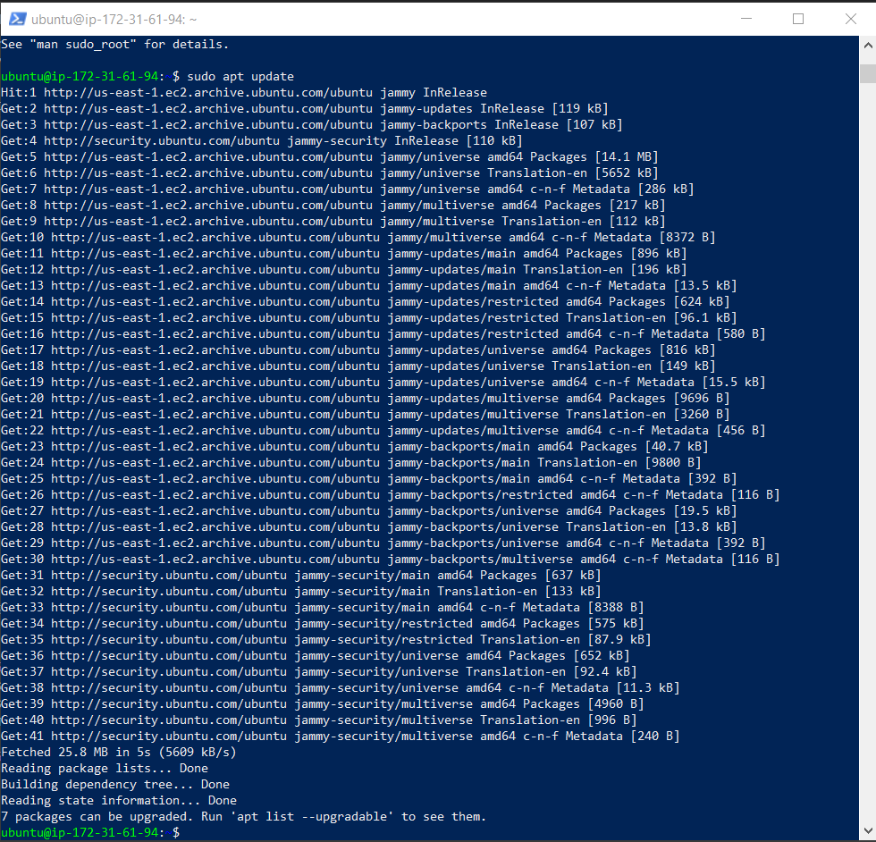
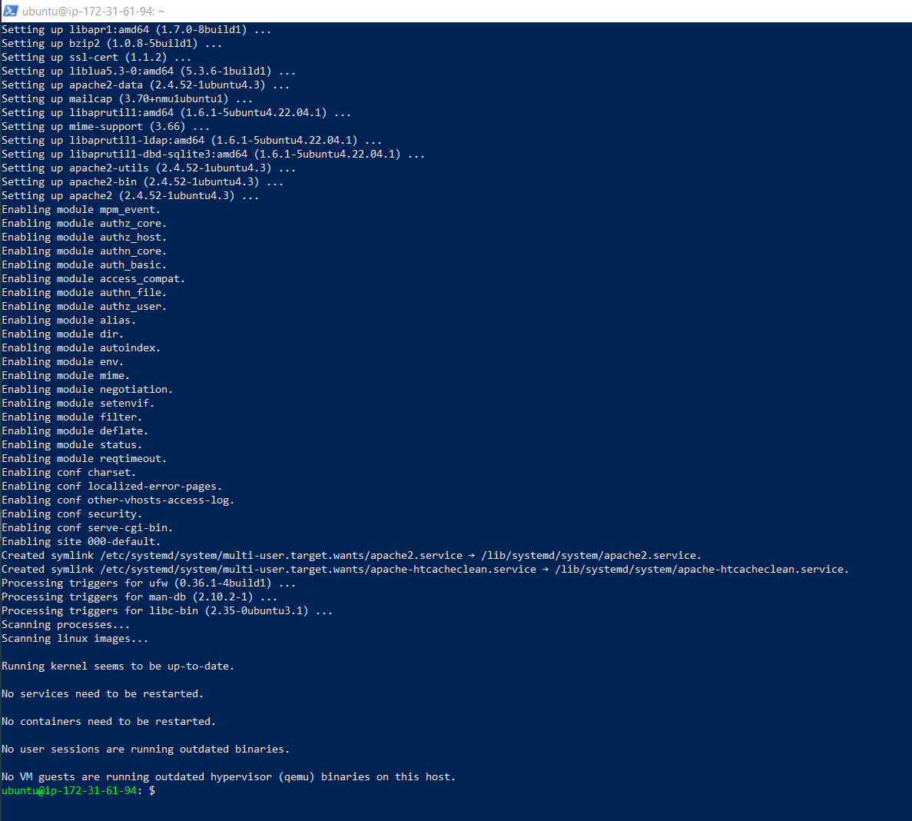
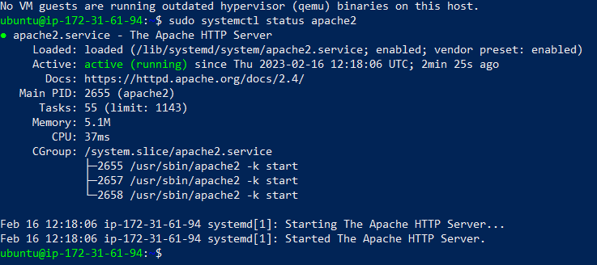
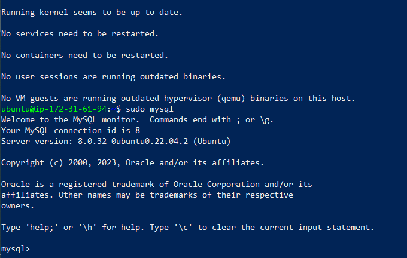
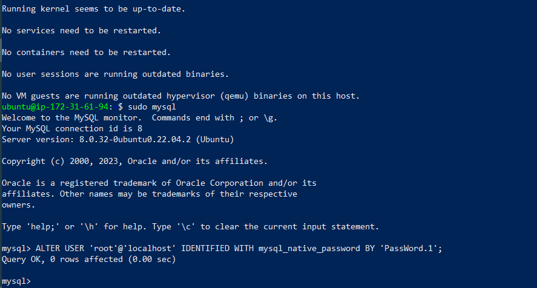
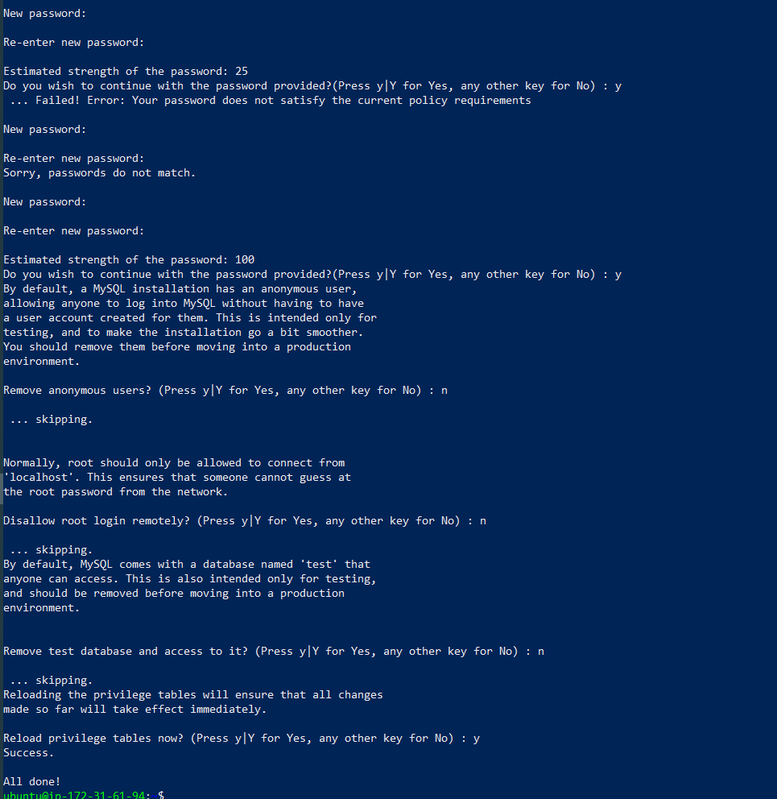
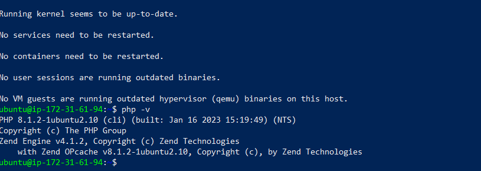
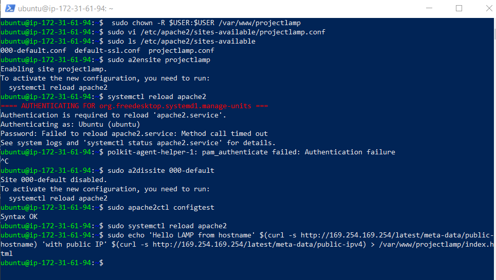

# DevOps-PBL-project-1
Devops PROJECT 1: LAMP STACK IMPLEMENTATION

## update a list of packages in package manager
sudo apt update

## run apache2 package installation
sudo apt install apache2

## To verify that apache2 is running as a Service in our OS, use following command
sudo systemctl status apache2

## Installing mysql
sudo apt install mysql-server

## Assignin password to mysql root user account
ALTER USER 'root'@'localhost' IDENTIFIED WITH mysql_native_password BY 'PassWord.1';

## validating root user password
sudo mysql_secure_installation

## Install php and its dependencies

## configure apache2 server and enable new site configuration

